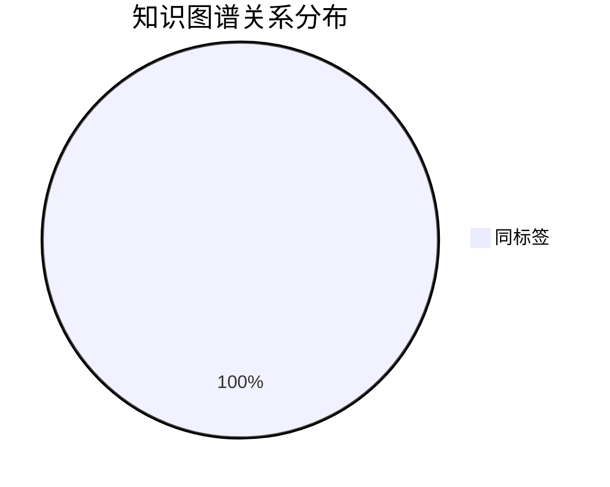

# 📊 论文知识图谱

*自动生成于 2026-07-30 22:17*

## 统计
- 📄 **论文总数**: 6
- 🔗 **关系总数**: 12

### 关系分布

| 关系类型 | 数量 |
|---------|------|
| 🏷️ 同标签 | 12 |

## 图谱可视化

```mermaid
graph TD
    1512_03385[Deep Residual Learning for Image Recogni (2016)] ---|image-classification| causal_feature_survey_wang[深度学习图像分类模型因果特征学习研究综述]
    causal_feature_survey_wang[深度学习图像分类模型因果特征学习研究综述] ---|image-classification| 1512_03385[Deep Residual Learning for Image Recogni (2016)]
    1512_03385[Deep Residual Learning for Image Recogni (2016)] ---|image-classification| teacfnet_tgrs2024[Texture-Aware Causal Feature Extraction  (2024)]
    teacfnet_tgrs2024[Texture-Aware Causal Feature Extraction  (2024)] ---|image-classification| 1512_03385[Deep Residual Learning for Image Recogni (2016)]
    causal_feature_survey_wang[深度学习图像分类模型因果特征学习研究综述] ---|image-classification| teacfnet_tgrs2024[Texture-Aware Causal Feature Extraction  (2024)]
    teacfnet_tgrs2024[Texture-Aware Causal Feature Extraction  (2024)] ---|image-classification| causal_feature_survey_wang[深度学习图像分类模型因果特征学习研究综述]
    neural_causal_abstractions[Neural Causal Abstractions (2024)] ---|causal-inference| neurips2025_bdcls[Counterfactual Image Editing with Disent (2025)]
    neurips2025_bdcls[Counterfactual Image Editing with Disent (2025)] ---|causal-inference| neural_causal_abstractions[Neural Causal Abstractions (2024)]
    neural_causal_abstractions[Neural Causal Abstractions (2024)] ---|causal-inference| teacfnet_tgrs2024[Texture-Aware Causal Feature Extraction  (2024)]
    teacfnet_tgrs2024[Texture-Aware Causal Feature Extraction  (2024)] ---|causal-inference| neural_causal_abstractions[Neural Causal Abstractions (2024)]
    neurips2025_bdcls[Counterfactual Image Editing with Disent (2025)] ---|causal-inference| teacfnet_tgrs2024[Texture-Aware Causal Feature Extraction  (2024)]
    teacfnet_tgrs2024[Texture-Aware Causal Feature Extraction  (2024)] ---|causal-inference| neurips2025_bdcls[Counterfactual Image Editing with Disent (2025)]

    linkStyle default stroke:#4a9eff,stroke-width:2px
    linkStyle default stroke:#888,stroke-dasharray: 5 5
    linkStyle default stroke:#ff6b6b,stroke-dasharray: 3 3
    linkStyle default stroke:#51cf66,stroke-width:2px
    linkStyle default stroke:#f08d49,stroke-dasharray: 5 5
```

## 关系分布图



## 论文节点

| ID | 标题 | 年份 | 标签 |
|---|------|------|------|
| neurips2025-bdcls | Counterfactual Image Editing with Disentangled Cau | 2025 | counterfactual-reasoning, causal-inference, image-editing, stable-diffusion |
| neural-causal-abstractions | Neural Causal Abstractions | 2024 | causal-inference, causal-abstraction, neural-causal-models, representation-learning |
| teacfnet-tgrs2024 | Texture-Aware Causal Feature Extraction Network fo | 2024 | remote-sensing, causal-inference, multimodal-fusion, texture-analysis |
| 2106.09685 | LoRA: Low-Rank Adaptation of Large Language Models | 2022 | parameter-efficient-fine-tuning, low-rank-decomposition, large-language-models, transfer-learning |
| 1512.03385 | Deep Residual Learning for Image Recognition | 2016 | computer-vision, residual-learning, image-classification, deep-learning |
| causal-feature-survey-wang | 深度学习图像分类模型因果特征学习研究综述 | ? | causal-feature-learning, explainable-AI, image-classification, survey |