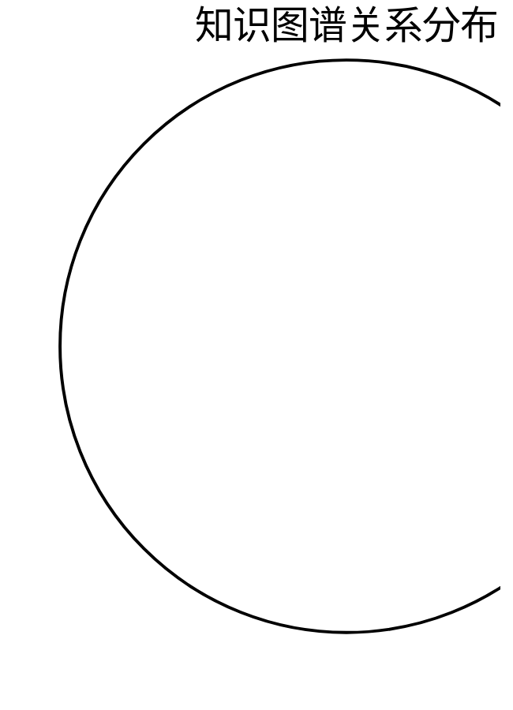

# 📊 论文知识图谱

*自动生成于 2026-07-30 20:14*

## 统计
- 📄 **论文总数**: 1
- 🔗 **关系总数**: 0

## 图谱可视化

```mermaid
graph TD

    linkStyle default stroke:#4a9eff,stroke-width:2px
    linkStyle default stroke:#888,stroke-dasharray: 5 5
    linkStyle default stroke:#ff6b6b,stroke-dasharray: 3 3
    linkStyle default stroke:#51cf66,stroke-width:2px
    linkStyle default stroke:#f08d49,stroke-dasharray: 5 5
```

## 关系分布图



## 论文节点

| ID | 标题 | 年份 | 标签 |
|---|------|------|------|
| 1512.03385 | Deep Residual Learning for Image Recognition | 2015 | 图像分割, 图像处理, 目标检测, 神经网络 |